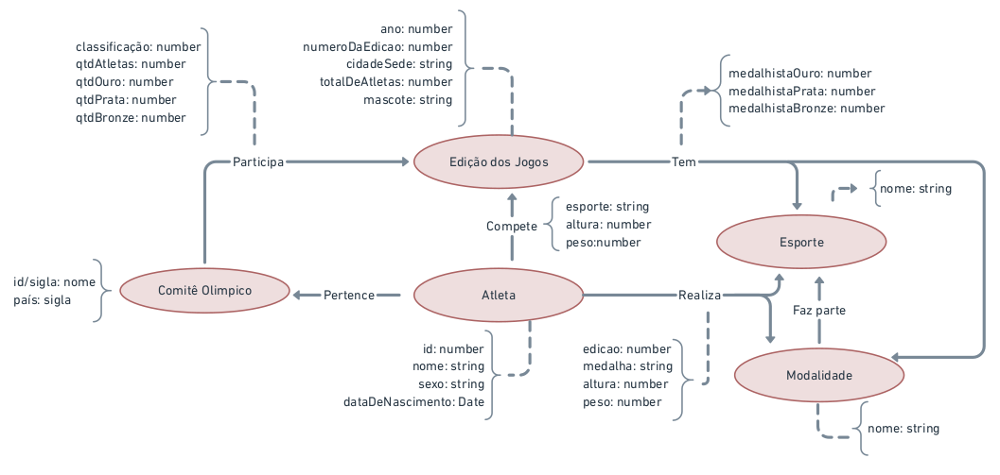

# Aluno
* `220407`: `Lindon Jonathan Sanley dos Santos Pereira Monroe`

## Modelo Lógico do Banco de Dados de Grafos
> 

## Perguntas de Pesquisa/Análise
> * Pergunta 1:
> Qual era a altura e peso de um atleta em cada edição que participou e como ela variou?
> * Pergunta 2:
> Qual a porcentagem média de modalidades de determinado esporte em que um atleta participa?
> * Pergunta 3:
> Como cresceram os esportes e modalidades a cada edição dos jogos?
