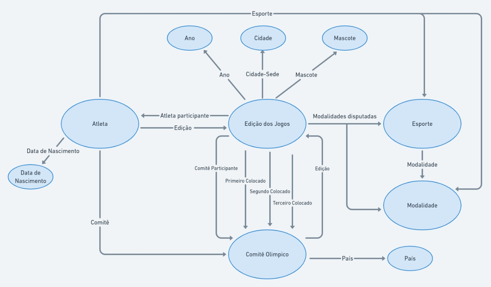

# Aluno
* `220407`: `Lindon Jonathan Sanley dos Santos Pereira Monroe`

## Exemplo de Grafo de Conhecimento - para publicar ou enriquecer
> 

## Perguntas de Pesquisa ou Queries

> Liste aqui as três perguntas de pesquisa ou queries
> * Pergunta 1: Para determinado atleta, nas edições que ele participou seu páis ficou no pódio? 
> * Pergunta 2: Se um atleta participa de mais de uma olimpíada, ele participa apenas das mesmas modalidades?
> * Pergunta 3: Para determinada edição, o país primeiro colocado participou em mais modalidades que o segundo? E o segundo participou em mais que o terceiro?
